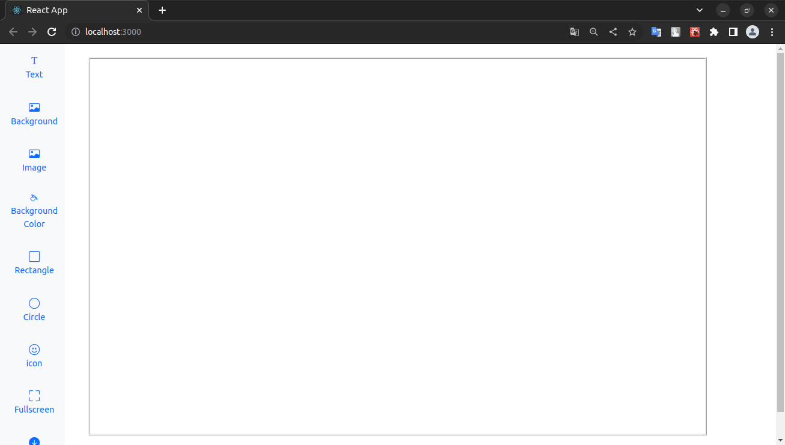
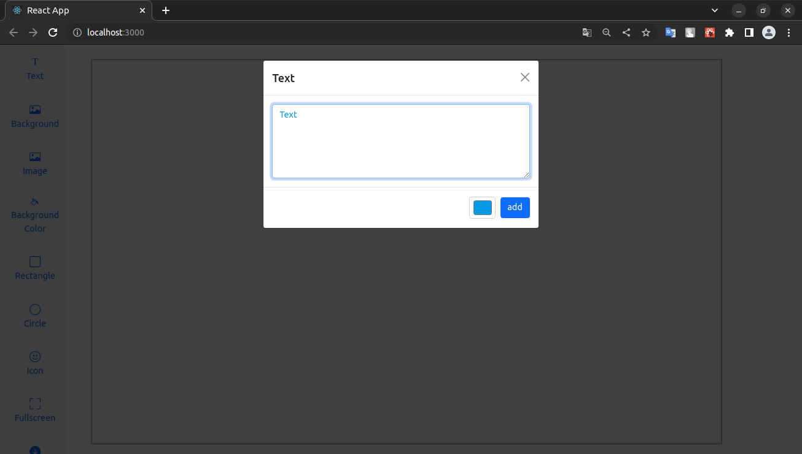
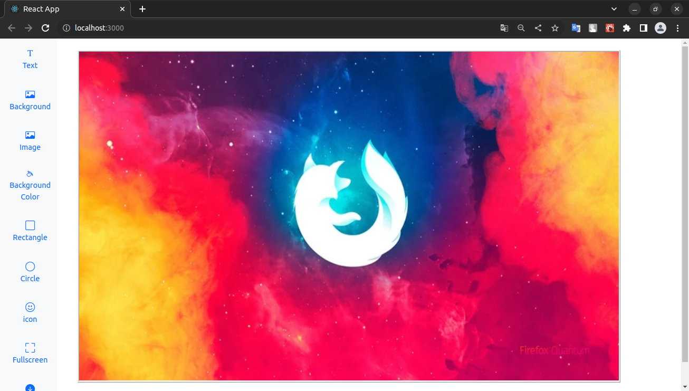
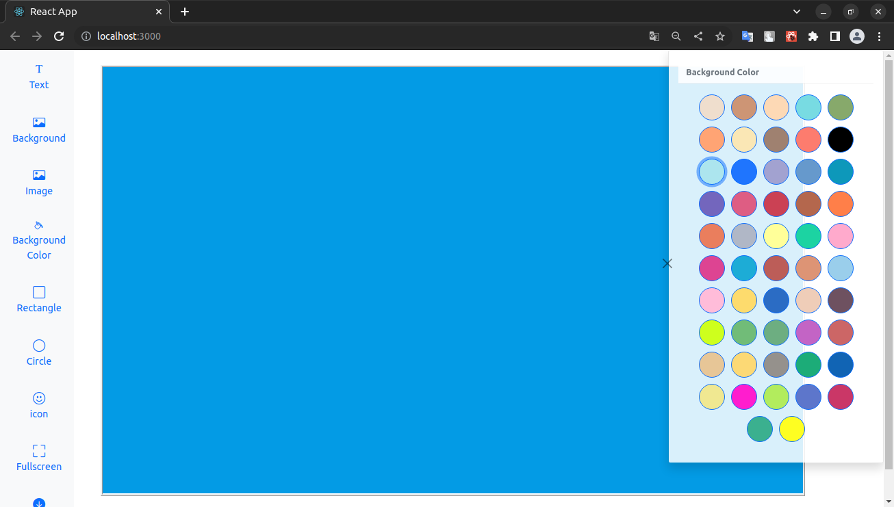
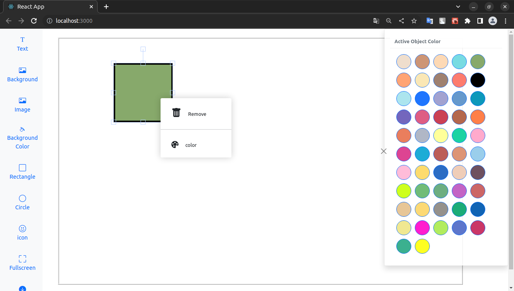

# react-design-editor

[Live Demo](https://react-design-editor.netlify.app/)

<h1>Getting Started</h1>

<pre>
git clone https://github.com/mikailaydogdu/react-design-editor.git
cd react-design-editor
npm install
npm start
</pre>
